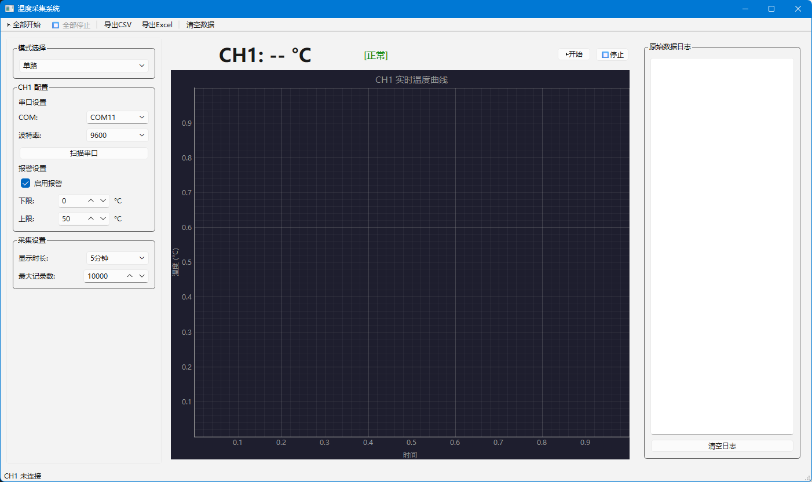
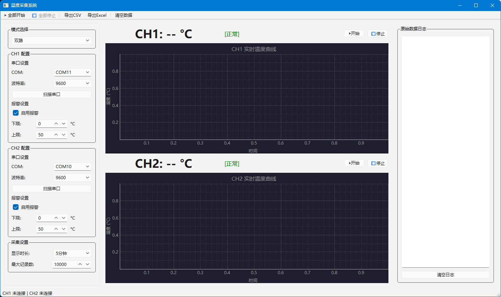

# 温度采集系统上位机

基于 Python 和 PySide6 的多通道温度采集系统上位机软件，支持串口通信、实时数据可视化、报警和数据导出。

## 功能特性

- ✅ 单路/双路温度采集模式切换
- ✅ 串口自动扫描（支持物理串口和虚拟串口）
- ✅ 实时温度大字体显示
- ✅ pyqtgraph 实时曲线图（独立子图）
- ✅ 温度超限报警（可配置上下限）
- ✅ 数据导出（CSV/Excel 格式）
- ✅ 配置持久化（JSON 格式）
- ✅ 原始数据日志显示

## 界面预览
**主界面：**

**双路模式：**



## 项目结构

```
温度采集系统/
├── main.py                 # 程序入口
├── config.json             # 配置文件（运行时自动生成）
├── pyproject.toml          # 项目依赖配置
├── README.md               # 项目说明文档
├── .gitignore              # Git 忽略文件
├── core/                   # 核心功能模块
│   ├── __init__.py
│   ├── alarm.py           # 报警管理器
│   └── data_manager.py    # 数据管理器
└── widget/                 # 界面模块
    ├── __init__.py
    ├── mainwindow.py       # 主窗口界面
    └── serial_worker.py    # 串口通信工作线程
```

## 安装与运行

### 环境要求

- Python 3.13 或更高版本
- 操作系统：Windows 10/11

### 安装步骤

```bash
# 1. 克隆或下载项目
git clone <repository-url>

# 2. 进入项目目录
cd 温度采集系统

# 3. 安装依赖（推荐使用 uv）
uv install

# 或使用 pip
pip install pyside6 pyserial pyqtgraph openpyxl
```

### 运行程序

```bash
# 推荐使用 uv
uv run main.py

# 或直接运行
python main.py
```

## 配置说明

### 配置文件结构

```json
{
    "mode": "single",
    "channels": {
        "1": {
            "serial": {"port": "COM11", "baudrate": 9600},
            "alarm": {"enabled": true, "low_limit": 0, "high_limit": 50}
        },
        "2": {
            "serial": {"port": "COM10", "baudrate": 9600},
            "alarm": {"enabled": true, "low_limit": 0, "high_limit": 50}
        }
    },
    "acquisition": {"max_records": 10000, "display_seconds": 300}
}
```

### 配置参数说明

- **mode**: 采集模式（single/dual）
- **channels**: 通道配置
  - **serial.port**: 串口号
  - **serial.baudrate**: 波特率
  - **alarm.enabled**: 是否启用报警
  - **alarm.low_limit**: 温度下限（°C）
  - **alarm.high_limit**: 温度上限（°C）
- **acquisition.max_records**: 最大记录数
- **acquisition.display_seconds**: 曲线显示时间范围（秒）

## 使用说明

### 串口配置

1. 选择采集模式（单路/双路）
2. 配置串口号和波特率
3. 点击"扫描串口"自动检测可用串口

### 数据采集

1. 点击"开始采集"启动数据采集
2. 实时温度显示在界面上
3. 温度曲线实时更新

### 报警设置

1. 配置温度上下限
2. 超限时温度显示变红
3. 支持启用/禁用报警

### 数据导出

1. 点击"导出CSV"或"导出Excel"
2. 选择保存路径
3. 数据按时间戳对齐导出

## 数据格式

### 串口数据格式

下位机发送数据格式：
```
TEMP:25.5\r\n
```

**格式要求**：
- 必须以 `TEMP:` 开头（大写）
- 温度值支持负数和小数
- 以 `\r\n` 结尾
- 每行一条数据

### 示例数据

```
TEMP:25.5
TEMP:-3.14
TEMP:100.0
TEMP:0.0
```

## 开发文档

### 核心模块

#### AlarmManager（报警管理器）

```python
# 初始化报警管理器
alarm = AlarmManager()

# 配置通道报警参数
alarm.setup_channel(channel=1, low=0, high=50, enabled=True)

# 检查温度是否超限
alarm.check(channel=1, temp=25.5)

# 获取报警状态
state = alarm.get_state(channel=1)  # "NORMAL"/"HIGH"/"LOW"
```

#### DataManager（数据管理器）

```python
# 初始化数据管理器
data_mgr = DataManager(max_records=10000)

# 添加温度记录
data_mgr.add_record(channel=1, temp=25.5)

# 获取历史数据
history = data_mgr.get_history(channel=1, seconds=300)

# 导出数据
data_mgr.export_csv("data.csv", channels=[1, 2])
data_mgr.export_excel("data.xlsx", channels=[1])
```

#### SerialWorker（串口工作线程）

```python
# 创建串口工作线程
worker = SerialWorker(channel_id=1, port="COM11", baudrate=9600)

# 连接信号
worker.temperature_received.connect(on_temperature)
worker.raw_data_received.connect(on_raw_data)
worker.connection_changed.connect(on_connection_changed)
worker.error_occurred.connect(on_error)

# 启动线程
worker.start()

# 停止线程
worker.stop()
```

### 信号说明

- **temperature_received(channel_id, temp)**: 温度数据信号
- **raw_data_received(channel_id, data)**: 原始数据信号
- **connection_changed(channel_id, connected)**: 连接状态变化信号
- **error_occurred(channel_id, error_msg)**: 错误信号

## 故障排除

### 常见问题

**Q1: 串口扫描不到设备**
- 检查串口设备是否正确连接
- 确认串口驱动已安装
- 在 Windows 设备管理器中查看串口设备

**Q2: 数据接收失败**
- 检查波特率设置是否匹配
- 确认数据格式正确（TEMP:25.5\r\n）
- 检查串口是否被其他程序占用

**Q3: 温度显示不更新**
- 检查串口连接状态
- 确认下位机正在发送数据
- 查看原始数据日志是否有数据

**Q4: 报警不触发**
- 检查报警是否启用
- 确认报警阈值设置正确
- 检查温度值是否真的超限

### 调试方法

1. 查看原始数据日志
2. 使用串口助手测试数据发送
3. 检查 config.json 配置文件

## 版本历史

### v0.1.0 (2026-05-14)
- ✨ 初始版本发布
- ✨ 支持单路/双路温度采集
- ✨ 实时温度显示和曲线图
- ✨ 温度超限报警功能
- ✨ 数据导出（CSV/Excel）
- ✨ 配置持久化
- ✨ 原始数据日志显示

## 许可证

MIT License


